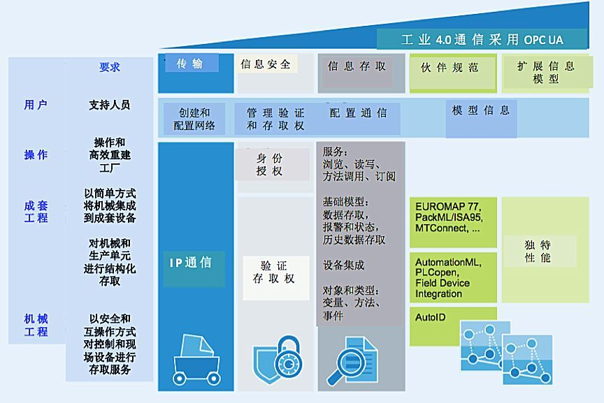
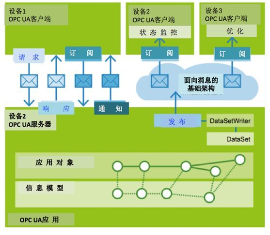
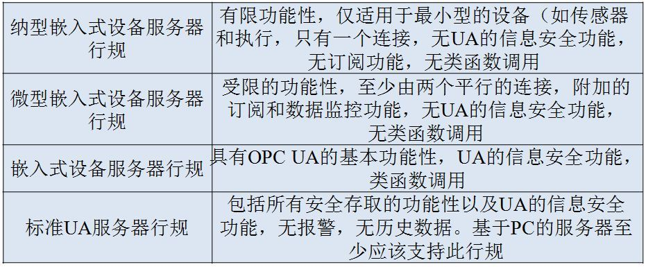

### OPC UA培训大纲
- 发展历史
    - opc 基本概念
    - opc 发展史
    - opc ua基本概念
    - opc ua发展史
- 基本概念
- 技术特点
- 技术原理
- 协议解读
- 开发过程及注意事项

### OPC UA培训大纲
rowKey | rowFamily

9:00－9:45 OPC UA 基本特点及应用场景
9:50－10:35 OPC UA重要概念
10:40－11:35 UA Server开发1-启停Server，发现服务
11:50－12:00 学员沟通
13:10－14:00 UA Client开发1-连接管理，发现服务
14:10－15:00 UA Server开发2-实时数据管理
15:20－16:00 UA Client开发2-数据读写 
16:10－17:00 开发课程（UA客户端）
开发课程（UA客户端） UA Server开发3-历史管理 + 计算

OPC UA是一种面向服务的架构SOA，为机械数据（诸如设备描述、测量数值、参数和控制变量）信息交换的标准化构建了合乎工业要求的平台。这里再一次强调指出，在工业4.0的环境下运用OPC UA，目的不是要取代机械装置内业已普遍使用的确定性通信的手段，而是为不同生产厂商生产的成套装置、机械设备和部件之间提供一种统一的通信方式。

- OPC UA主要解决“安全的语义互操作”，OPC UA确保异构网络中的数据能够按照统一的标准来定义，这样，它主要聚焦在ISO/OSI模型的会话、表示、应用三个层面，建立连接、用统一的信息模型规范来表达应用场景中的“设备行规”。

物理层、数据链路层、网络层、传输层、会话层、表示层、应用层。

物理层：在物理媒体上传输原始的数据比特流。
数据链路层：将数据分成一个个数据帧，以数据帧为单位传输。有应有答，遇错重发。
网络层：将数据分成一定长度的分组，将分组穿过通信子网，从信源选择路径后传到信宿。
传输层：提供不具体网络的高效、经济、透明的端到端数据传输服务。
会话层：进程间的对话也称为会话，会话层管理不同主机上各进程间的对话。
表示层： 为应用层进程提供格式化的表示和转换数据服务。
应用层：提供应用程序访问OSI环境的手段。

要解决的问题包括了连接、安全、信息模型多个层次的问题。

OPC统一架构（OPC UA，IEC62541）是一套安全、可靠且独立于制造商和平台并用于工业通讯的数据交互规范。该规范使得不同操作系统和不同制造商的设备之间可以进行数据交互。

OPC UA采用基于语义和面向服务（SOA）的架构。它以统一的架构与模式，既可以实现设备底层的数据采集、设备互操作等横向信息集成，还可以实现设备到SCADA、SCADA到MES、设备与云端的垂直信息集成。

它支持几个方面的问题：
（1）连接问题：对于C/S架构的，包括支持TCP,WebSocket/http的传输机制，另外也开发了针对Pub/Sub机制的连接，包括最新的架构中对于MQTT/AMQP方面的支持，这使得通过OPC UA即可方便的与云端应用系统进行连接，而且更低的流量消耗。
（2）信息模型：是构成OPC UA的核心，它指为了实现协同所需的信息模型，包括了基础元模型（DA,HA,AC,程序），以及伴随信息模型，或称为行业信息模型，如PLCopen,Eruomap,MTConnect,PackML、Automation ML等
（3）安全的传输机制，在整个C/S或Pub/Sub、信息模型的传输过程中，都包括了安全的连接建立、数据加密机制，这些依赖于信息安全标准的集成。

OPC UA和TSN仅是一些技术标准与规范

Prosys OPC UA：
- 官网地址:http://www.prosysopc.cn/

搭建开发环境

- 安全政策:
    - 无
    - Basic128Rsa15
    - Basic256
    - Basic256Sha256
- 通信协议
    - UA-TCP UA-SC UA Binary
    - HTTPS UA Binary

参考地址:
- http://www.sohu.com/a/284690695_464000

包括：传输、信息安全、信息存取、伙伴规范和扩展信息模型。
- 在工业4.0的环境下运用OPC UA，目的不是要取代机械装置内已普遍使用的确定性通信手段，而是为不同生产厂商生产的成套装置、机械设备和部件之间提供一种统一的通信方式。
- 传输层实现采用不同通信协议和通信类型的信息存取，但这些不同的通信协议和通信类型必须有一个共同的基础，要求网络的基础架构一定要赋有IP通信的能力。

- 客户端－服务器通信直接实现客户端和服务器之间的数据交换，消息的接收是被确认的。
- 发布端－订阅端通信类型适合于间接的数据交换，发送者和接收者无需彼此知晓，也无需同时被激活。它适合于大量的传感器与一个接收器相通信的场景（例如云端的状态监控和优化服务），或一个发送端和多个接收端的场景。一台注塑机可以同时向公司的多个不同的服务器（如可视化、MES或节能系统）发送其材料用量和能源使用量的测量值，就是后面那种应用场景。

根据OPC UA Server的使用场景，OPC基金会提出了一个行业规范。根据设备大小分别有纳型嵌入式服务器、微型嵌入式服务器、嵌入式服务器、标准服务器，这些OPC UA Server能够使用的硬件资源（如计算能力、内存等）有很大差别，所以能够提供的功能也有很大差别。

OPC UA的优势：
1.一个通用接口集成了之前所有OPC的特性和信息，A&E,DA,OPC XML DA or HDA
2.更加开放，平台无关性，WINDOWS,LINUX都能兼容
3.扩展了对象类型，支持更复杂的数据类型比如变量，方法和事件
4.在协议和应用层集成了安全功能，更加安全
5.易于配置和使用

OPC和OPC UA协议区别：
OPC虽然通过配置COM/DOM来提供数据加密和签名功能，配置防火墙，用户权限来让数据访问变得更加安全，但是会增加额外的工作量，尤其是对非IT的工程师来说；对于OPCUA，数据加密和签名，防火墙等都是默认的功能。比如基于DOM的OPC使用的动态端口分配，端口不固定，让防火墙难以确定，而OPC UA的端口都是唯一的，比如SINUMERIK 840D是PORT 4840，SIMATIC S7是PORT 4845。DOM/COM也可以生成不同级别的事件日志，但日志内容不够详细，只会提供“谁连接上服务器”这种，而对于OPC UA来说都是默认的功能，生成的日志内容更全面。

核心的区别是因为OPC和OPC UA协议使用的TCP层不一样，如下：

OPC是基于DOM/COM上，应用层最顶层；OPC UA是基于TCP IPscoket 传输层。

SDK有没有经过标准认证;

根据opc ua统一架构一书讲解不同场景下ua的解决方案;

jdk选择openjdk 
https://adoptopenjdk.net/
java 8

- 概念
数字证书是指CA(电子认证服务)机构发行的一种电子文档，是一串能够表明网络用户身份信息的数字，提供了一种在计算机网络上验证网络用户身份的方式，因此数字证书又称为数字标识。数字证书对网络用户在计算机网络交流中的信息和数据等以加密或解密的形式保证了信息和数据的完整性和安全性。

- 原理
数字证书的基本架构是公开密钥PKI，即利用一对密钥实施加密和解密。其中密钥包括私钥和公钥，私钥主要用于签名和解密，由用户自定义，只有用户自己知道；公钥用于签名验证和加密，可被多个用户共享。 [2] 
数字证书的基本工作原理主要体现在： [2] 
第一，发送方在发送信息前，需先与接收方联系，同时利用公钥加密信息，信息在进行传输的过程当中一直是处于密文状态，包括接收方接收后也是加密的，确保了信息传输的单一性，若信息被窃取或截取，也必须利用接收方的私钥才可解读数据，而无法更改数据，这也有利保障信息的完整性和安全性。 [2] 
第二，数字证书的数据签名类似于加密过程，数据在实施加密后，只有接收方才可打开或更改数据信息，并加上自己的签名后再传输至发送方，而接收方的私钥具唯一性和私密性，这也保证了签名的真实性和可靠性，进而保障信息的安全性。

opc ua通讯推荐书籍：OPC Unified Architecture by Mahnke, Leitner and Damm (Springer-Verlag, 2009, ISBN 978-3-540-68898-3).

地址空间模型
信息模型
- 基本信息模型
- 标准信息模型

引用通过不同的引用类型表达不同的语义

节点通用属性 p18
引用类型的附加属性 p21
对象的附加属性 p26
变量的附加属性 p26

属性、特性、hasComponet、hadProperty的区别与联系 p50

特性的建模规则 p51

特性的语义是由它的浏览名称定义的，因此节点的每一个特性必须有一个唯一的浏览名称，特性不能成为任何层次化应用的源，这意味着特性不能再拥有特性。

##  OPC UA培训问题梳理

1. 自我介绍，想做哪些方面，想了解哪些方面
2. opc da与opc ua的对接，mitrakon参与opcua开发；
3. 本土的plc型号混乱，driver众多；IOT MQTT；采集opcua设备，转到自己的平台（普通的采集标准）
4. opcua往IOT方向走，融合IT和OT；
5. 两个PPT，自己的和李丹的ppt；
6. 抽象类型：不可实例化，基础类型，一般是用子类型可以实例化；
7. opcua服务自动发现的原理；
8. opcua的安全策略和安全模式的区别；
9. opcua中数字认证的原理；
10. prosys opcua java sdk中client连接server时的重连机制；
11. opcuaserver中实时订阅原理：
12. 通过modeler进行建模，建出来的模型可以生成代码；
13. channel和session的加密方式不一样；
14. 教师系统；
15. prosys代理的是谁的？
16. 用opcua实现用户权限控制；
17. 外网如何对内网的数据进行下至；
